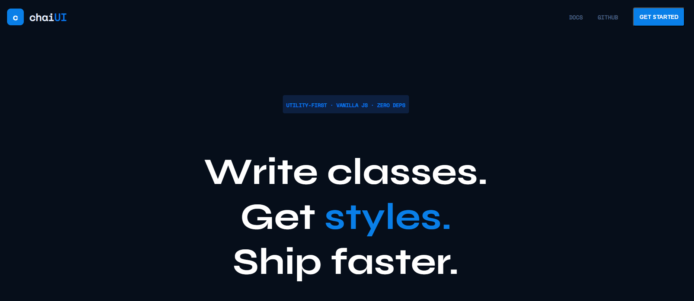
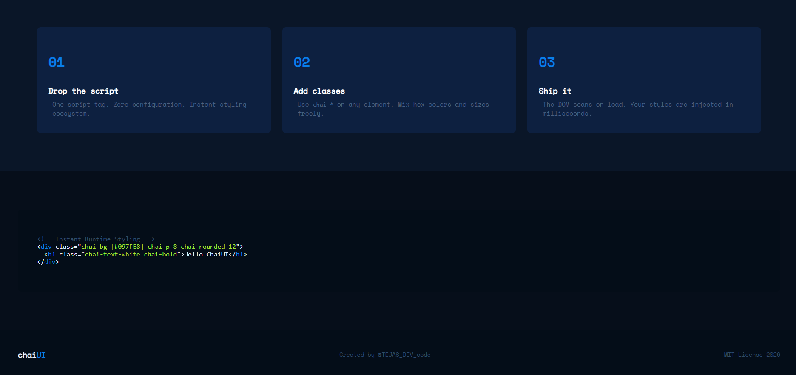

1. Use via CDN (easiest)

2. Use via npm (modern projects)
npm install chaiui-js

import { initChaiUI } from "chaiui-js";
initChaiUI();

Live Demo

👉 https://your-demo-link.com

⭐ Star this repo if you found it useful

# chAiUI – Style at Runtime

Write classes. Get styles. No build step.

chAiUI is a lightweight utility-first CSS engine built using pure JavaScript.  
It scans your HTML, parses custom `chai-*` classes, and applies styles dynamically at runtime.

---

## Preview

---

## Why chAiUI?

Traditional styling:
- Write CSS  
- Maintain stylesheets  
- Manage class names  

With chAiUI:
- No CSS file  
- No configuration  
- Just write classes and go 

---

## How It Works

1. The script scans the DOM after page load  
2. It finds all classes starting with `chai-`  
3. Each class is parsed using a custom parser  
4. Styles are converted into inline CSS  
5. Styles are applied dynamically to elements  

---

## Example

  Hello ChaiUI 

## Supported Utilities

## Spacing
chai-p-4 → padding
chai-m-2 → margin

## Colors
chai-bg-red
chai-text-blue
chai-bg-[#097FE8]

## Layout
chai-flex
chai-flex-col
chai-center
chai-gap-4

## Typography
chai-text-[18px]
chai-bold
chai-text-center

## Borders
chai-border
chai-border-[#0d2040]
chai-rounded-8

## Getting Started
1. Clone the repo
git clone https://github.com/coderTejas565/chaiui.git

2. Add script to your HTML

3. Start using classes

  Start Building 

## Tech Stack
Vanilla JavaScript
DOM Manipulation
Custom Parsing Engine

## What I Learned
How utility-first CSS frameworks work internally
How to build a parsing system from scratch
DOM traversal and dynamic style injection
Thinking like a framework developer

## Future Improvements
Hover utilities (chai-hover-*)
Responsive system
Transitions & animations
Convert into npm package

## Author

Built with ❤️ by Tejas